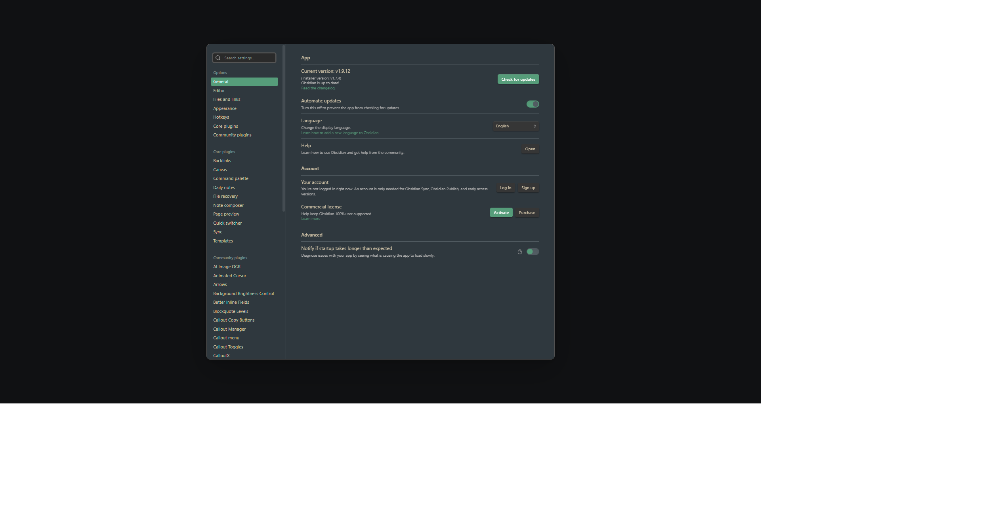

# DarkSlide

**Dial in the perfect brightness for any Obsidian theme.**

Ever find a theme you love, but it's just a bit too dark? Or maybe it's too bright when you're working late at night? DarkSlide adds a simple slider to your status bar that lets you adjust how dark or light your theme looks—without actually switching themes.

  

> **Important note:** This isn't a theme switcher. It adjusts the brightness of whatever theme you're already using. Think of it like a brightness dial for your current theme.

## What it does

DarkSlide adds a slider to your status bar (bottom right). Drag it left to make things darker, drag it right to make things brighter. That's it.

Each theme remembers its own brightness setting

Changes happen instantly as you move the slider

There's a reset button when you want to go back to normal

It works everywhere: the editor, sidebars, tabs, modals, even plugin panels. And it works with any theme without modifying the theme files themselves.

## How to use it

Look at the bottom-right corner of Obsidian. You'll see a sun icon (☀️) with a slider next to it.

**Drag left** = darker  
**Drag right** = brighter  
**Click the reset button** (↺) = back to normal

That's all there is to it. Your settings save automatically.

## Installation

DarkSlide is pending approval for the Obsidian Community Plugins marketplace.

### Install with BRAT (recommended)

1. Install the [BRAT plugin](https://github.com/TfTHacker/obsidian42-brat)
2. Open command palette (Ctrl/Cmd + P)
3. Run "BRAT: Add a beta plugin for testing"
4. Enter: `Th0rGarden/obsidian-darkslide`
5. Enable DarkSlide in Settings → Community Plugins

### Manual installation

1. Download `main.js`, `manifest.json`, and `styles.css` from the [latest release](https://github.com/Th0rGarden/obsidian-darkslide/releases)
2. Go to your vault's `.obsidian/plugins/` folder
3. Create a folder called `darkslide`
4. Drop all three files in there
5. Restart Obsidian
6. Enable the plugin in Settings → Community Plugins

Can't find the plugins folder? In Obsidian, go to Settings → About and look under "Advanced" for links to your vault folder.

## When you might use this

Honestly, I made this because I kept finding themes I liked, but they were always just a bit too dark or too bright for different times of day. Maybe you:

- Love a theme but it's too dark for daytime work
- Have a dark theme that's not quite dark enough
- Want to go extra dark for focus sessions without switching themes
- Work in different lighting throughout the day
- Just like tweaking things until they feel right

Start with small adjustments (±10 to ±20) and go from there. The slider goes from -100 to +100, but you usually don't need to go that extreme.

## What's new in v1.1

- Added a reset button to the status bar slider
- Each theme now remembers its own brightness
- Tweaked how colors are calculated

## A quick note

This plugin works by applying a color overlay to backgrounds. It works well with most themes, but some themes with very specific styling might not respond perfectly to the adjustment. If you find one that doesn't work right, let me know.

## License

This is free for personal use, but the code is proprietary. You can use it, but please don't redistribute or modify it. See [LICENSE.md](LICENSE.md) for the full terms.

Need a commercial license? Email th0rgardentools@proton.me

## Bugs and requests

Found something broken or have an idea? [Open an issue](https://github.com/Th0rGarden/obsidian-darkslide/issues).
