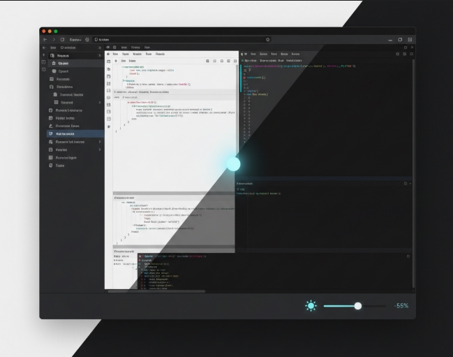

# DarkSlide for Obsidian

**Slide into darkness (or light).** An Obsidian plugin that lets you adjust background brightness across any theme with a status bar slider.

<p align="center">
  
</p>


## ✨ Features

- 🎚️ **Status Bar Slider**: Always-accessible brightness control right in your status bar
- 🌓 **Live Adjustment**: Watch backgrounds darken or brighten as you drag the slider (-100 to +100)
- 🎨 **Universal Theme Support**: Works with any Obsidian theme without modifying the theme itself
- ⚡ **Instant Feedback**: Real-time preview as you adjust
- 💾 **Auto-Save**: Settings persist across sessions
- 🎯 **Comprehensive Coverage**: Affects editor, sidebars, ribbons, tabs, modals, and more
- 🔌 **Plugin-Aware**: Even adjusts backgrounds from other plugins using custom CSS variables

## 🚀 Usage

**Status Bar Slider** (easiest!):
1. Look at the bottom-right corner of Obsidian
2. Find the ☀️ sun icon with a slider next to it
3. Drag the slider left (darker) or right (brighter)
4. That's it! Changes apply instantly.

**Settings Panel**:
1. Click the ☀️ sun icon in the ribbon, or go to Settings → DarkSlide
2. Use the slider to adjust brightness
3. Hit the "Reset" button to return to normal (0)

## 📥 Installation

### Manual Installation

1. Download `main.js` and `manifest.json` from the [latest release](https://github.com/Th0rGarden/obsidian-darkslide/releases)
2. Create a folder called `darkslide` in your vault's `.obsidian/plugins/` directory
3. Place both files in the `darkslide` folder
4. Reload Obsidian
5. Enable DarkSlide in Settings → Community Plugins

### Development Setup

1. Clone this repo into your vault's `.obsidian/plugins/` directory:
   ```bash
   cd /path/to/your/vault/.obsidian/plugins/
   git clone https://github.com/Th0rGarden/obsidian-darkslide.git darkslide
   cd darkslide
   ```

2. Install dependencies:
   ```bash
   npm install
   ```

3. Build the plugin:
   ```bash
   npm run build
   ```

4. Reload Obsidian and enable the plugin

### Development Mode

```bash
# Watch for changes and auto-rebuild
npm run dev
```

## 💡 Tips

- **Make it darker**: Try values between -30 to -70 for a deeper, more focused dark mode
- **Make it brighter**: Values between +20 to +50 can help if your theme is too dim
- **Reset anytime**: Click the "Reset" button in settings to return to 0 (theme default)
- **Auto-save**: Your preference saves automatically when you release the slider
- **Per-vault**: Each vault remembers its own brightness setting

## 📜 License

**Custom License - Personal Use Only**

You may use this plugin freely for personal purposes, but you may not modify, copy, fork, or redistribute it. The source code is available for transparency and education, but all rights are reserved.

💼 **Need commercial licensing?** Contact: th0rgardentools@proton.me

See [LICENSE.md](LICENSE.md) for complete terms.

## 🤝 Support

Found a bug or have a feature request? Open an issue on GitHub!

## ⚠️ Disclaimer

This plugin modifies CSS to adjust background brightness. While it works with most themes and plugins, some custom themes or plugins with very specific styling may not be fully affected. The plugin aims for comprehensive coverage but cannot guarantee 100% compatibility with all possible theme configurations.
